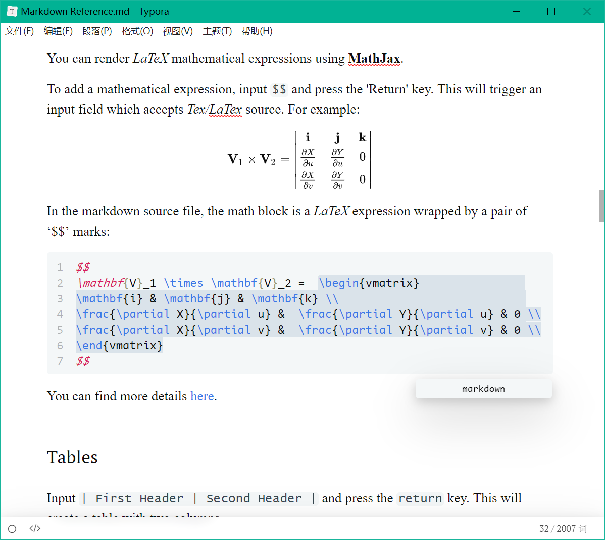

# typora-themes
Repository of My Typora Themes.

## Usage:

1. File>Preferences>Appearance>Open Themes Folder

2. Copy all contents of the `typora-themes/themes` folder into the folder you just opened.

3. Restart Typora.

The `conf` sub directory contains my Typora configuration.

## Screen shots

Here are some screen shots 

### Newsprint Material

### Newsprint Seti

### Newsprint Fluent

### Orangeheart

## About these themes

These themes are not my Copyrights, all of them are created by others and can be downloaded from the Typora theme website <https://theme.typora.io>, I just personalize them and improve them (From my own aesthetic perspective).